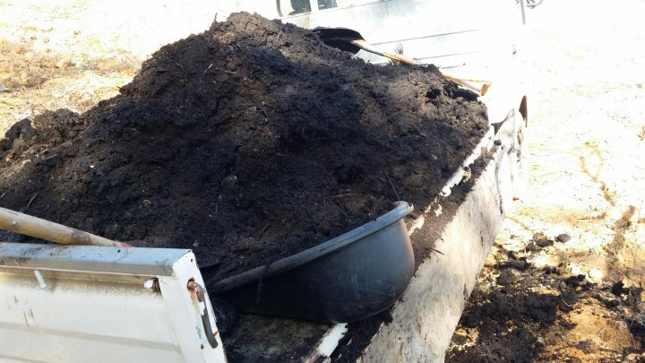
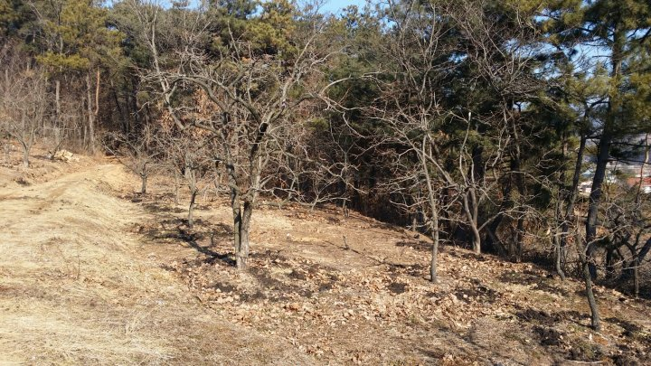
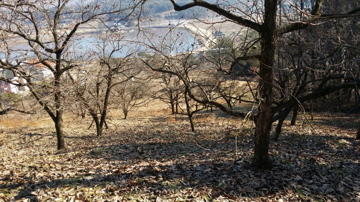
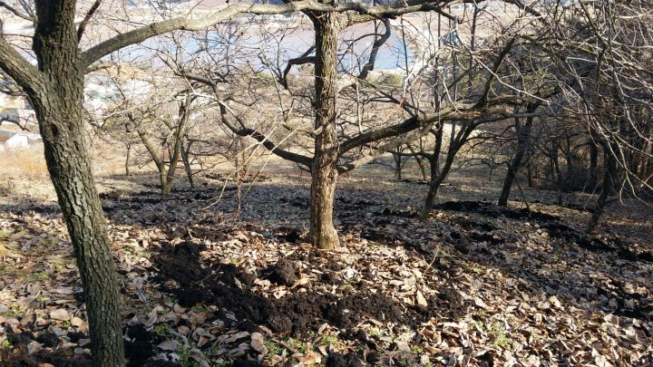

# 2015년 1월 13일 오후 08:44
150113년 농사일지^^
복숭아 나무에 거름 내는 일은 마무리  했고
어제부턴 감나무에 거름을 내기 시작 했다
이제 두어차만 거름을 내면 올해 거름내는
일은 마무 될것 같고 다음은 감나무 전정하고
감나무 전정 마무리 되면 블루베리 나무 전정하고
퇴비내고ᆢ
이 모든일이 마무리 될때쯤  꽃피는 삼월이 찿아
오겠지 ᆢ

