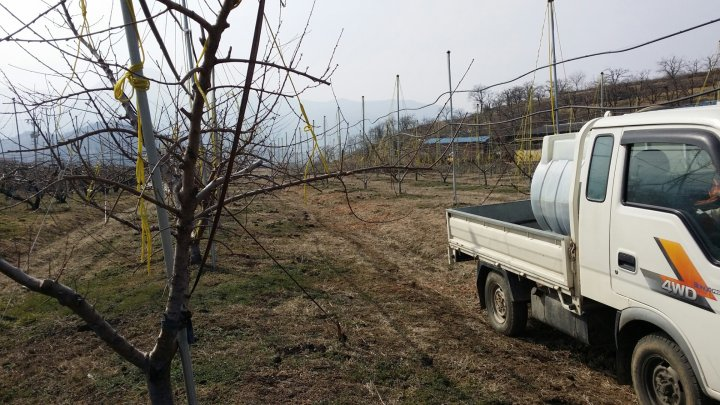
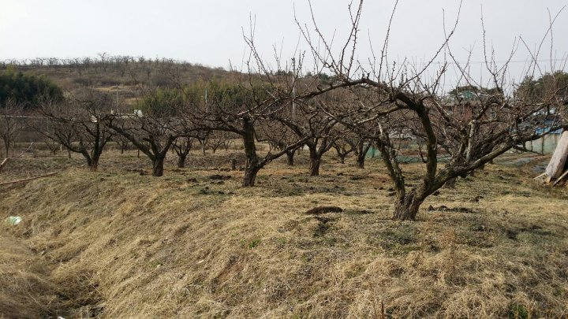

# 2015년 3월 17일 오후 08:14
150315 청화농원 농사일지^^
15일 16일 이틀간 복숭아 나무 자두나무 매실나무 황소독 방제^^
추운 겨울날 동면한 병해충 방제로 황소독 방제를
하였다ᆞ일년 병해충 방제중 첫 시작이자 제일
힘든 방제다ᆞ
올해도 어김없이 콧물 눈물에 땀까지 덤뿍담아
원없이 흘렸다
가지치기 퇴비내기 황소독 방제까지 마쳤으니
복숭아 농사일중에 힘든일은 해결했다ᆞ
이젠 예쁜 도화가 활짝 피기를 기다리면서ᆢ

