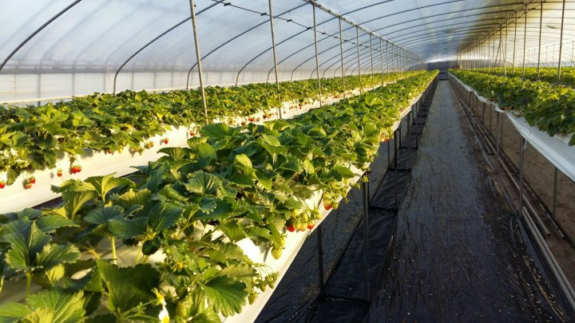
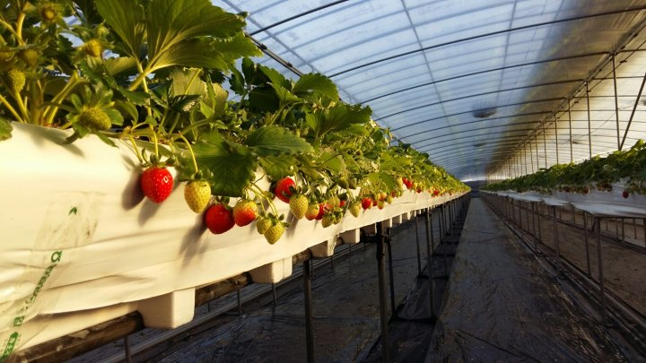
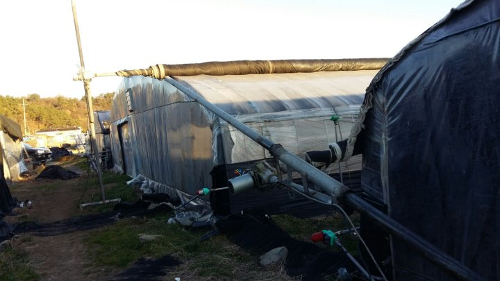

# 2016년 12월 6일 오후 04:50
161206 청화농원 농사 일지^^
일몰ᆢ
나의 농장은 서쪽산에 해 넘어갈때 일몰이자
하루를 마감 한다
하우스내에 따뜻한 기온이  떠나갈까봐 붙잡을려고
오늘도 애를 태우는 서산의 햇님만 바라 본다
올들어 제일 추운 영하 7도를 넘나든다는 일기 예보에 긴장이 된다
전년도에 처음으로 토경 딸기 농사를 시작 할때도
신기 하기도 하고 애도 태우고ᆢ
그래도 겨울에 활짝 웃음짖는 딸기 꽃이 넘 예쁘다
올해는 고설 재배 딸기 농사 양을 늘리다 보니 밤 온도에 긴장이된다
이제 햇님을 뒤에 두고 무거운 발 걸음을 옮긴다ᆢ

