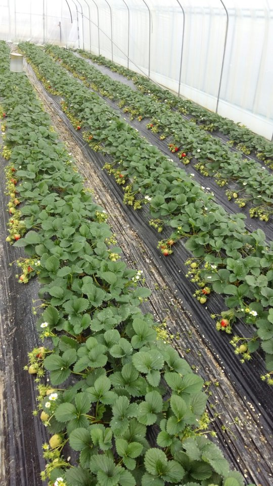
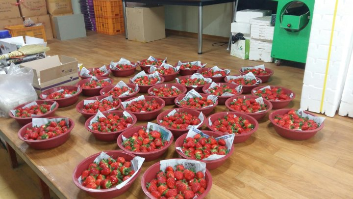
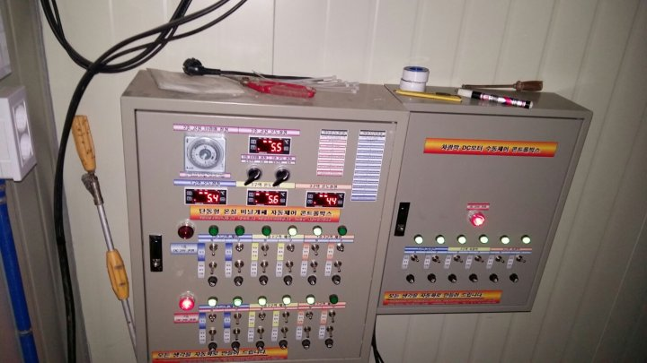
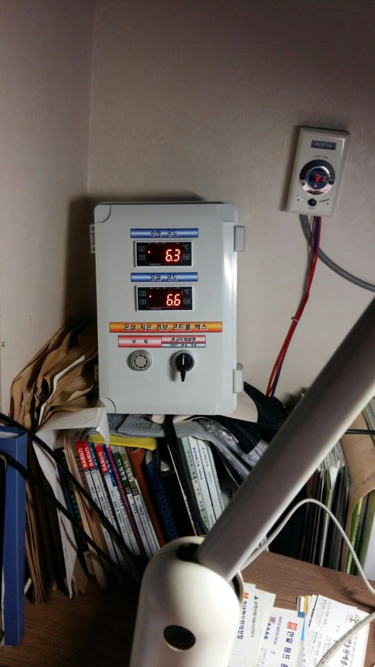

# 2016년 1월 19일 오후 09:14
160119 농사 일지^^
처음부터 쉽게 편안하게 지나갈 생각은 없었다ᆢ
지나간 시간 되돌아보니 그 시간보다 더하랴
생전 처음 지어보는 딸기 농사
좌충우돌ᆢ
하우스 개폐량 조절을 못해 찜질방이 될뻔했던 시간들ᆢ
수막 파이프 고장나서 냉탕이 될뻔했던 뜬눈으로 지낸 시간ᆢ
오늘은 매서운 찬바람 생생부는 초저녁 부터  마음 이 긴장된다ᆢ
초저녁 인데도 영하 7도에 하우스 온도 5도에서 머뭇 거린다
혹시나 하는 마음에 알콜 깡통에 불 붙혔다
다행이 현재 1도 올라 6도까지 올라갔다
이제 12시 까지는 온도가 내려가지 않을것 같다
알콜 소모시간 3시간정도 되니까 12시 까지는 
휴식이다ᆢ
혹시나 해서 저온 경보계 켜두고 한잠 푹ᆢ

