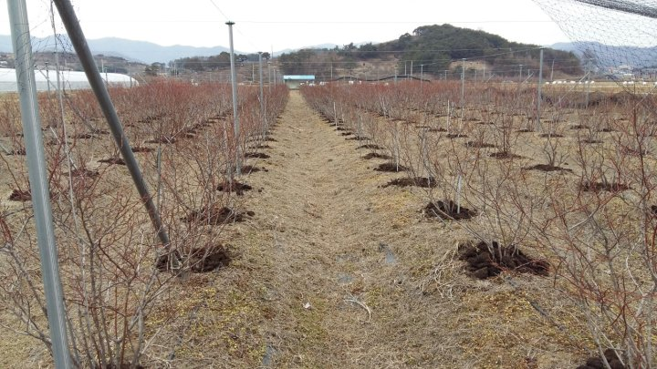
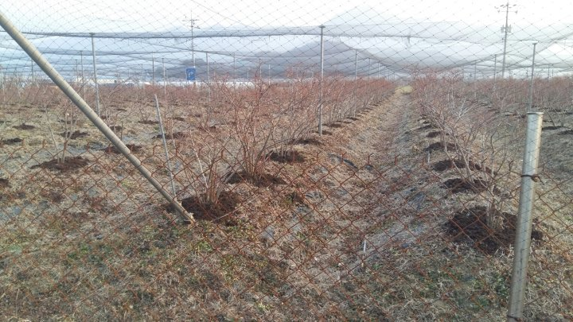

# 2016년 1월 21일 오후 07:45
160118~21 영농일지 ᆢ
병신년 새해를 맞아 블루베리 농원에 
퇴비 내는일을 마무리 하였다ᆢ
전년도에 잘 자라주어 전년도보다
꽃눈이 튼실하다ᆢ기온이 따뜻한  관계로
넘 일찍 크진건지  생육이 좋아서 잘 자라주는지는 
계속 지켜봐야 할 것 같다
이제 부터는 겨울 전정 하면서 꾸준이 지켜봐야
할것 같다ᆢ

