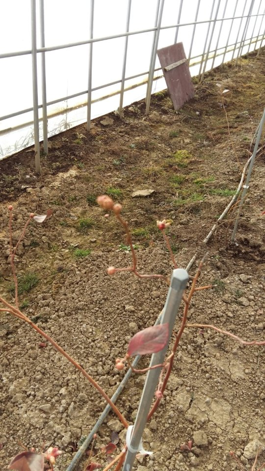
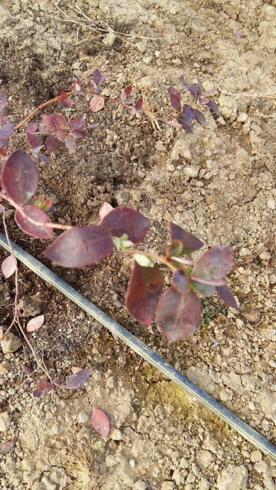
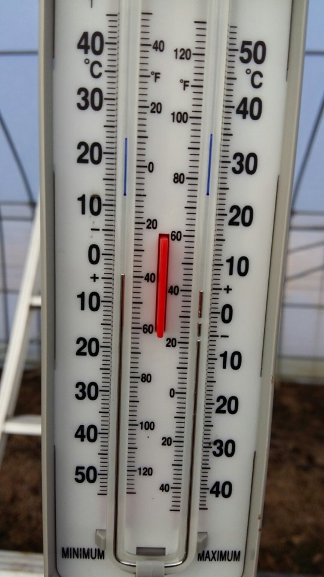
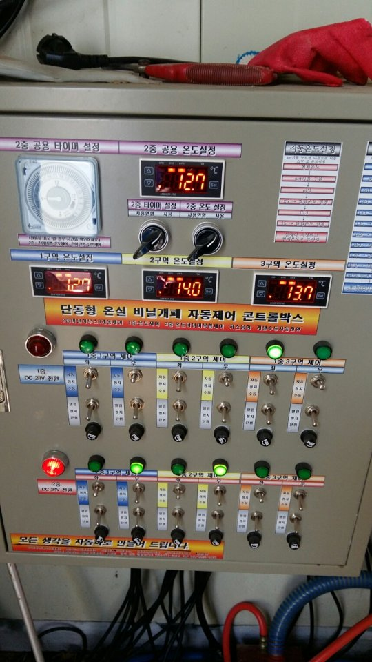

# 2016년 1월 25일 오전 10:16
160125 청화농원 영농일지^^
1중 블루베리 하우스에 봄소식이 들려온다
전년도에 가족이 되었다
추위에 견디고 생육 상태를 보기위해 
1중 하우스 상태로 지켜보고 있는데 새로운 
소식이 찿아왔다
10시 현재 바깥온도 영하 11도를 알리고
1중 블루베리 하우스는 영상 4도
2중 딸기 하우스는 영상 13도를 넘어간다
하우스 크기 차이는 있겠지만 10도 정도
온도차가 생긴다
이러한 조건에서 스타 품종이 꽃망울은 먼저 
커지고 잎은 신틸라 품종이 먼저 고개를 내민다ᆢ
4월까지 지켜보고 12월엔 2중 비닐을 덮어야겠다

