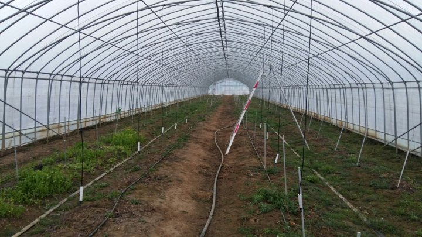
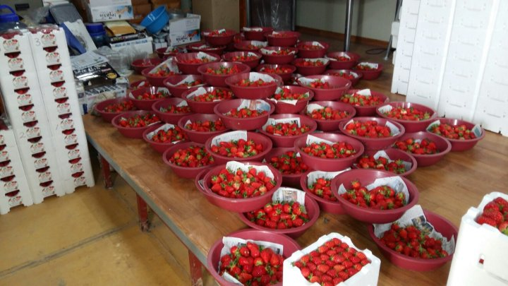

# 2016년 2월 28일 오후 09:02
160228  청화농원 농사일지^^
오늘은 평소보다 바쁜 하루를 보낸다
아직 하루일을 마무리 못하고 있다
자정을 넘기지 않을려고 바삐 서두른다
딸기 수확하고 포장 하면서 틈틈히  
블루베리 하우스 2중 수막 농수관 설치하고
수막용 스프링쿨러 달고 2중 하우스엔 블루베리나무 관수용 및 미생물 관주용 
스프링쿨러 설치 중이다
지금은 딸기 포장중에 잠깐 쉬면서  지나간 시간들을 되돌아본다
32년전 어느 3월에 나의 입영 전날은 어떤 마음 이었을까
어제 같은데ᆢ
내일은 세남매중 둘째 큰아들이  논산훈련소로
병역의 의무를 시작하러 가는날이다
지금까지 마음고생 많이 하고 자랐는데
내색않고 잘 커줘서 너무 고맙고 사랑한다
스스로 병역의 의무를 다하기 위해 길을 택한 
아들이 고마울 따름이다
짧고 긴 시간은 내마음 다잡기에 달렸는데
새로운 환경과 시간속에 즐거운 시간과 뜻깊은
시간들을 만들고 용감하고 멋진 청년이 되어
돌아 오기를 마음을 모으며 
아버지는 여기서 조용히 아버지 할일을 하면서
기다릴것이다ᆢ

