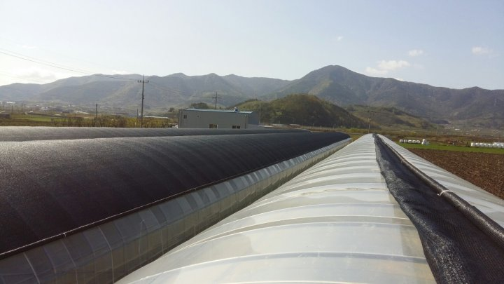

# 2016년 4월 17일 오후 01:03
160417 청화농원 농사일기^^
청도 토평 들판에도 밤새도록 바람소리와 함께
잠을 청했다
깜깜한 밤에 귓가에 맴도는건 바람과 창문  떨리는 소리ᆢ
깊은밤에 어찌할수도 없어면서 담배불만이
동행을ᆢ
농사일 시작한지 5년쯤에
우박도ᆢ
돌풍도ᆢ
바람앞에 등불이 되었다
그래도 이쯤에서 멈춰줘서 고마울 뿐이다
오전에 하우스 위에서 기어다니다보니 
긴장이 풀려 피곤함이 몰려온다

