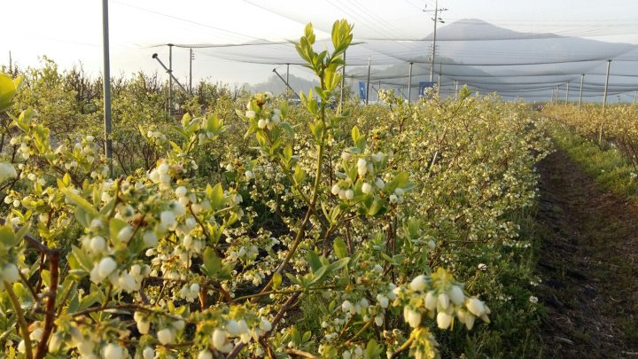
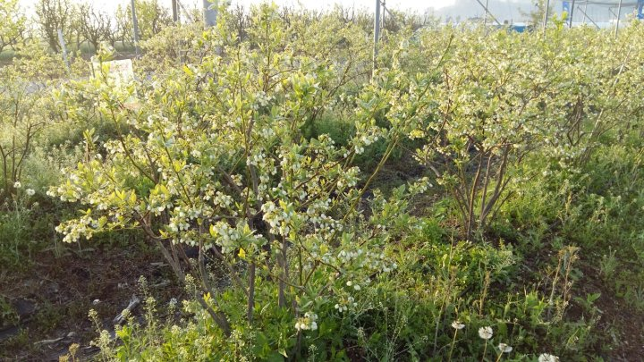
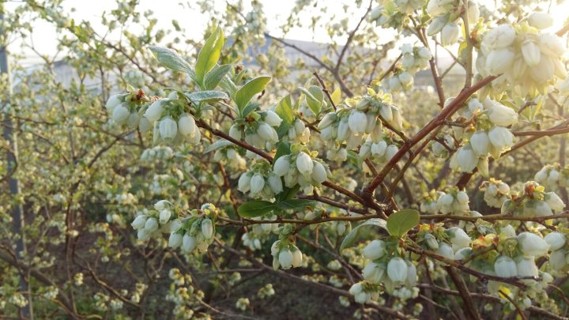

# 2016년 4월 26일 오전 07:05
160425  청화농원 농사일기^^
오늘은 미드미 영농조합에서 충청도 불개미 영농조합에 견학을 다녀 왔습니다
전날 이서중고등학교  총동창회 체육대회의
즐거웠던 시간과 함께 청도에서의 시간과 다른
시간을 만났습니다
잠깐 못본 시간에 블루베리 꽃들도 만개하고
푸르른 잎들이 쑥쑥 자랐습니다
전년도 보다 개화도 빠르고 나무도 잎도 
생기가 나고 꽃들도 예년보다 많이 찿아 
왔습니다ᆢ
올해는 대풍의 기운을 간직한채 
오늘도 일터로 달려갑니다^^

