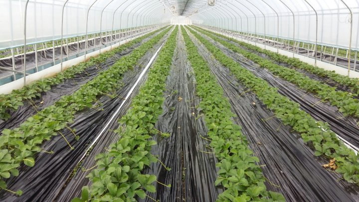
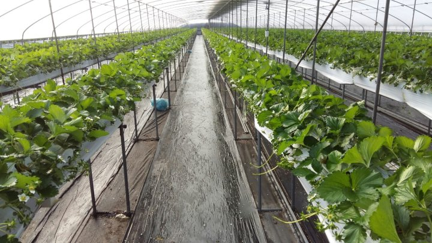
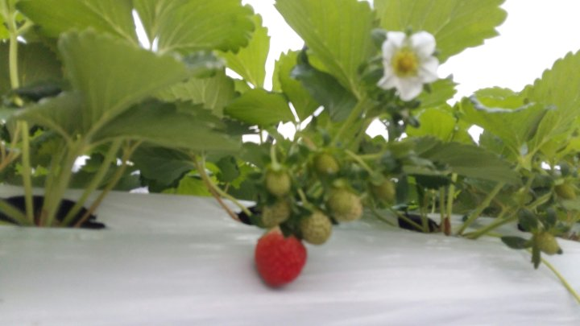

# 2017년 11월 4일 오전 10:09
171104 청화농원 농사 일기ᆢ
매일 아침 6시에 출근을 한다
출근 않으면 하루 일당을 주지 않겠다는 무언의 압박ᆢ
정말 나쁜 회사다
그래도 싫지 앓고 밉지 않은건 아직도 불러 주기에 항상 감사하며  오늘도 즐겁게 내 할일을 찿아서 한다
자기도 기분이 좋은지 아침마다 방긋 웃으면서 
기다리고 있다
몇일 전부터는 하얀 꽃옷을 입었는데 요즘은 하얀꽃에 빨간 향기를 담고 반겨준다
전년도엔 힘들었던 날들이 많았는데 올해는 
다같이 마음을 모은 덕분에 매일 따뜻하게 반겨준다
오만명이 넘는 식구들이 찬바람 불어오는 겨울날에도 step by step
올해는 감기 걸리지 않고 건강 하기를 기원 하면서 ᆢ

