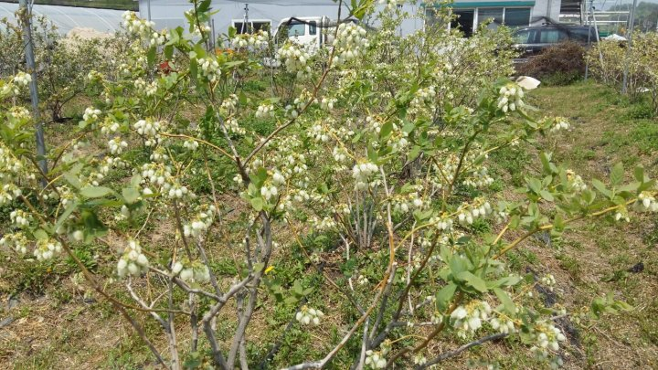
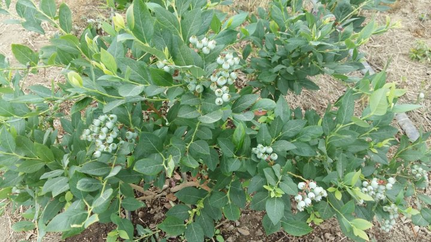
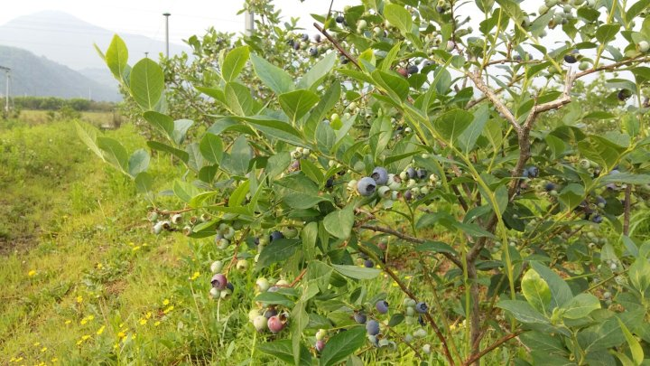
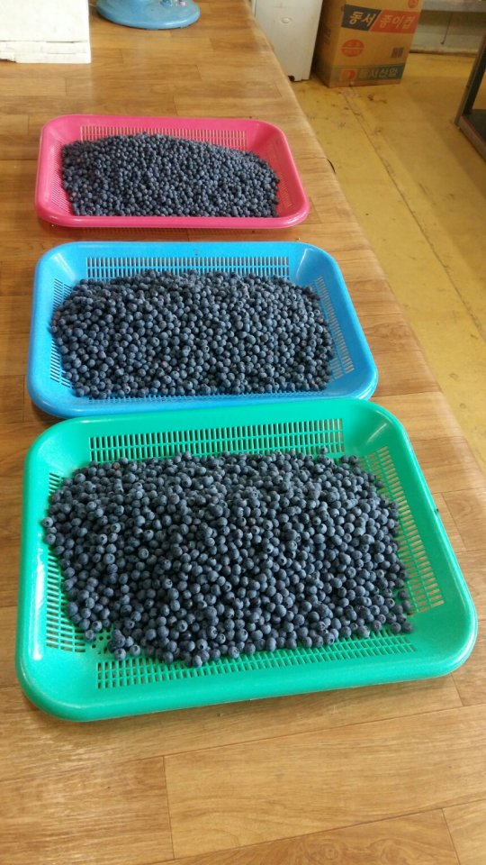

# 2017년 6월 10일 오전 07:25
20170609  청화농원 농사일기^^
매서운 추위의 산을 넘고 아지랑이 속으로
빨려 들어가는 싱그로운 봄을지나 이제 모든 사람들의 
사랑을 받으러 떠나려 한다
꽃피던 봄날에 갑자기 내린 친구들 때문에 힘들었을텐데도 친구들이 먼저 떠난 힘겨움을 훌훌 털고
꽃 피워준 친구들이 너무 고맙고 많은 분들을 사랑하고 사랑 받기를 기도 하면서 이제 보내려 한다ᆢ
올 겨울엔 따뜻한  집을 짓도록 해볼께ᆢ
안~~~녕

