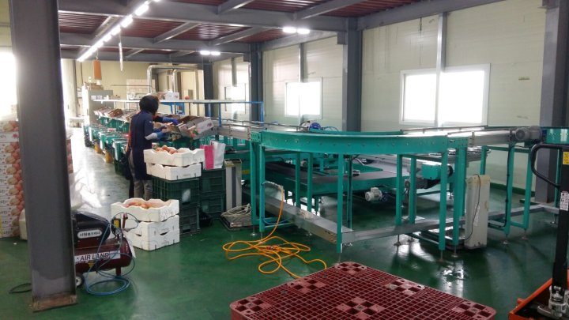
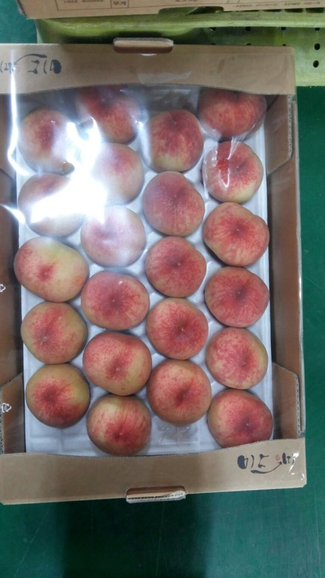
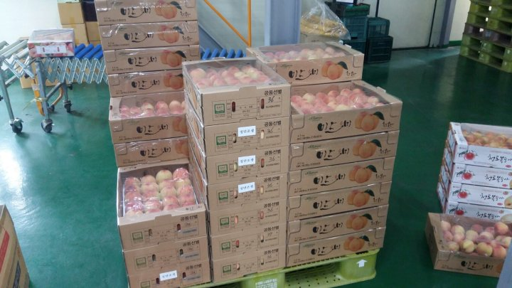

# 2017년 6월 25일 오후 04:24
170619 청화농원 농사일기^^
오늘은 2017년도 복숭아 첫 복숭아  정만조생ᆢ
가지치기하고 적과 한지가 엇그제 같은데
벌써 수확의 시간ᆢ
무서운줄 모르고 겁없이 살았는데
이젠 무서움도 느끼고 겁이 난다
시간이ᆢ
유별리 비가 내리지 않아서 가슴을 태웠는데
이렇게 무탈하게 자라줘서 너무나 감사한 마음 입니다 ᆞ

