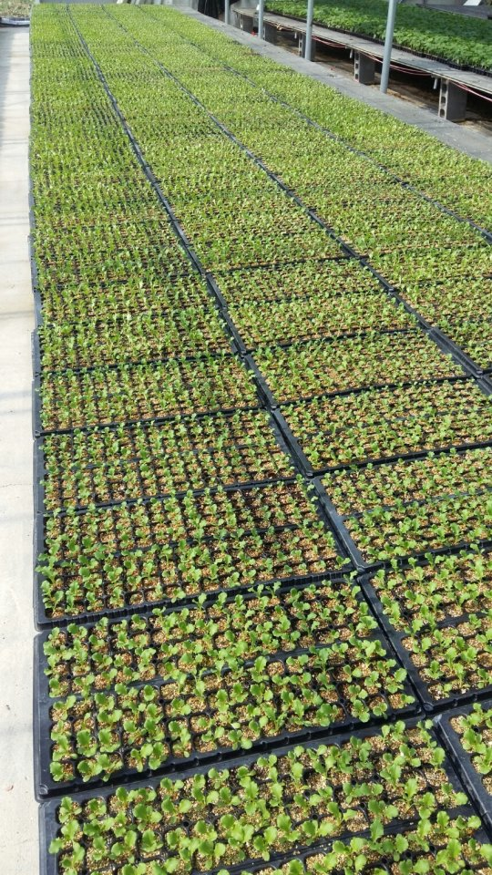
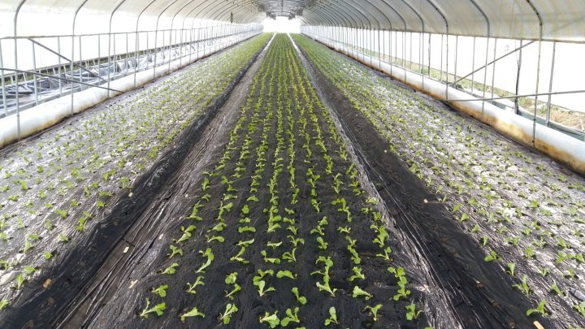
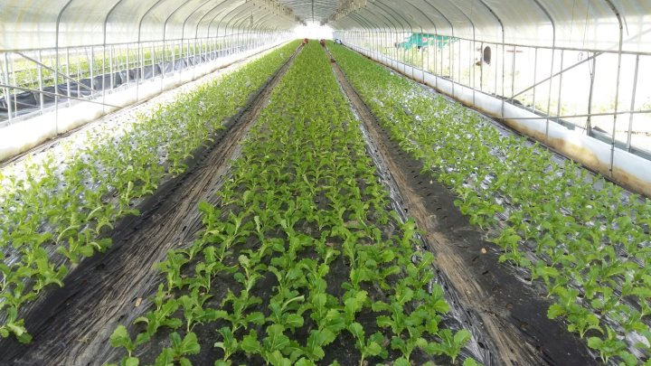
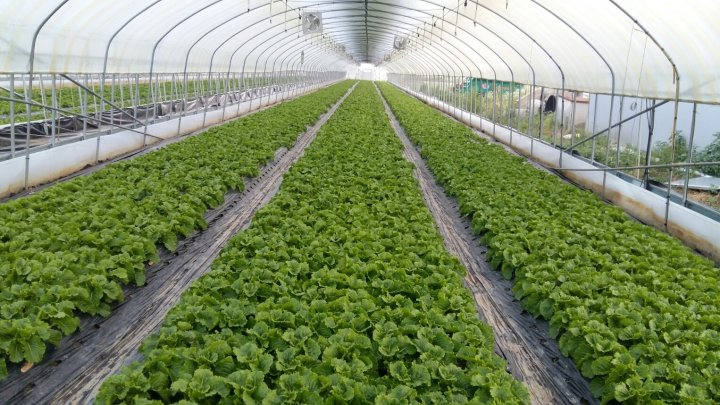

# 2017년 6월 25일 오후 07:46
170621 청화농원 농사일기 ᆢ
동쪽 하늘에 붉은 태양빛이 내 가슴에
젖어들때 하루의 기지게를 펴본다ᆢ
살아 있어줘서 고맙다는 인사말과 더불어 오늘 하루도 시간과 동행 한다
바쁜 생활속에 새가족이 된지 엊그제 같은데
이젠 떠날 준비를 한다
몇밤만 세면은 따뜻한 이별 이지만 또다른
인연을 기원 하면서ᆢ

