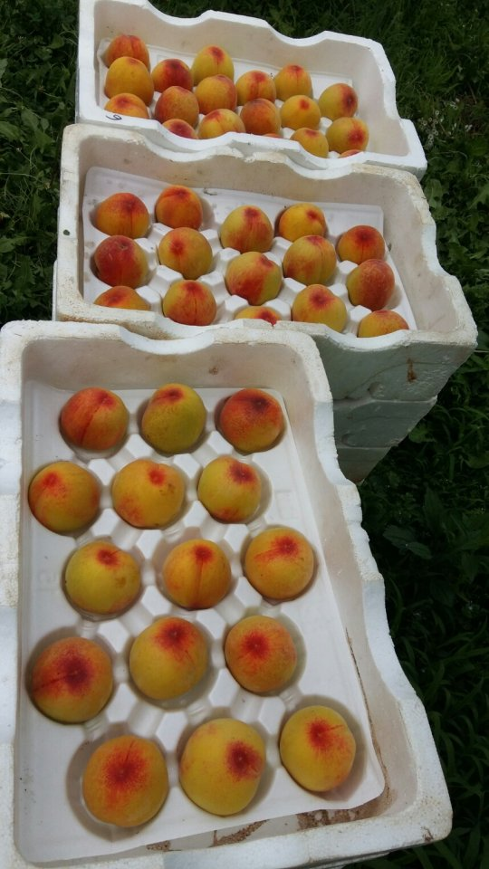
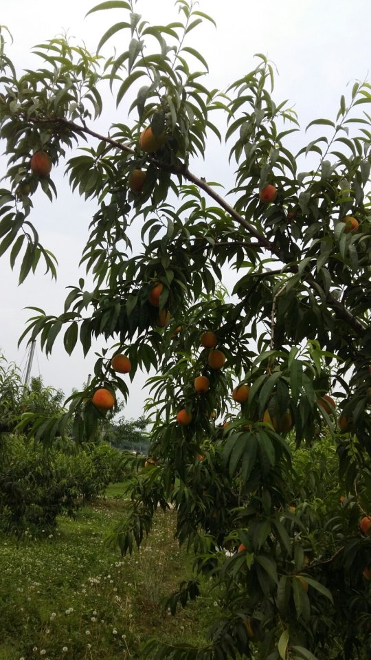
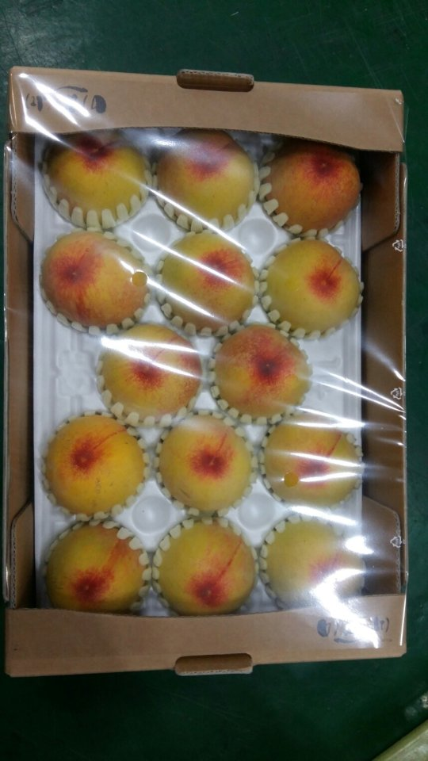
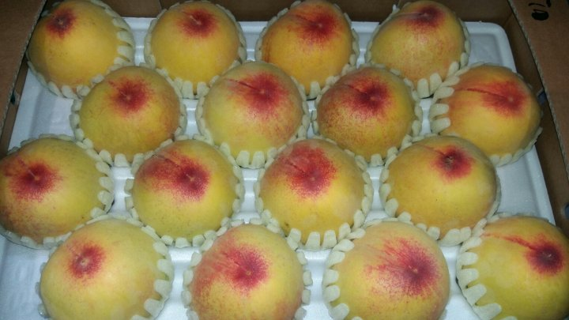

# 2017년 6월 25일 오후 08:02
170625 청화농원 농사일기ᆢ
오늘은 이럴까 저럴까 온갖 생각에 바쁜 하루를 보냈다
대석 자두 마무리 수확중에 미황 복숭아는 철없이
자꾸 부른다
전년도엔 26일부터 짝꿍 했는데 올해는 더 보챈다
난 자두랑 베리랑 놀고 있는데 자꾸 보챈다
자두랑 베리는 집에 델고 와서 시원 한데서 쉬게하고 난 미황하고 놀러 갔다
지도 나도 더운데 낮 잠 못자고ᆢ
그래도 좋은 인연 만나서 떠날때엔 편안하고 시원 한데서ᆢ

