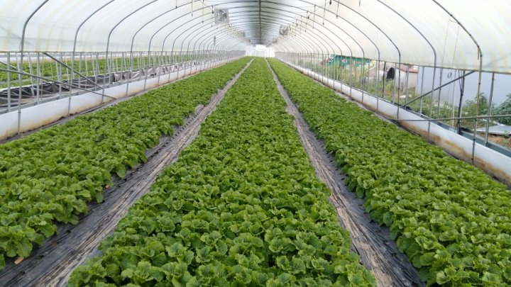
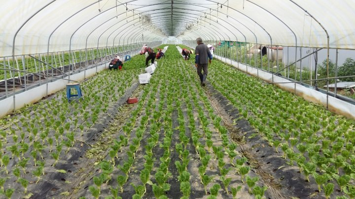
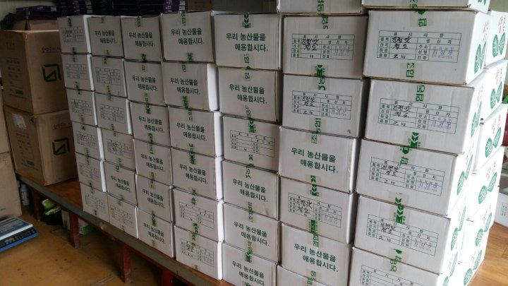

# 2017년 6월 27일 오후 02:32
170627  청화농원 농사일기^^
오늘은 처음으로 짓는 상추 첫수확 날 이다
딸기 수확후 이모작으로 상추를 선택 했다
고추ᆞ토마토ᆞ메론ᆞ수박 등 여러 작물중에
상추를 심었다
처음 접해본 농사라 수확 시기도 몇일 지나고
좌충우돌 하루를 보낸다
다행히 상추 농사를 해본 지인들의 도움으로 오늘
첫 수확을 한다
수확이 늦어진 관계로 많이 땃는데도 아직도ᆢ
어제 딴 자리에 오늘 아침에 보니 성큼 자라 있었다
밤사이 무럭 무럭 자랐나 보다ᆢ

