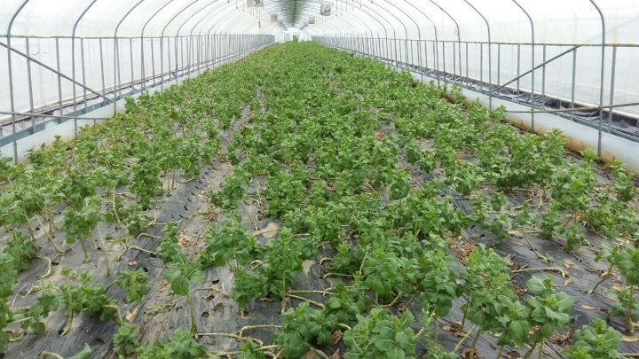
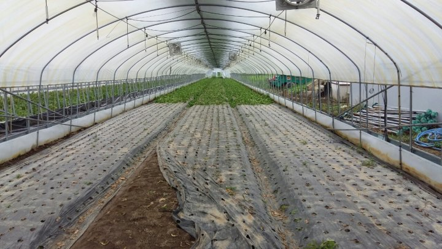
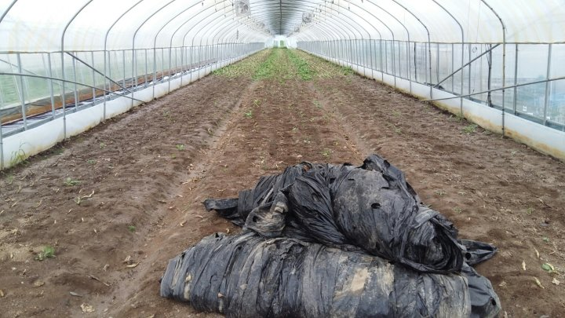

# 2017년 8월 15일 오후 02:40
170815 청화농원 농사일기^^
2017년도 무더웠던 여름도 입추가 지나고 말복을 지나 처서가 다가오니 아침 저녁으론 
한결 선선하다
봄인가 싶더니 여름을 지나 가을 문턱을 손짓한다
이제 청화농원의 여름도 지나 가을 농사 준비를 시작한다
청화농원 에서는 여름철 농사일이 제일 바쁘다
매일 바쁜 직장 생활 이지만 그래도 여름날이 즐겁다
봄 부터 씨뿌려 가꾸어 결실의 계절이다
블루베리랑 복숭아 수확기 이기 때문이다
올해는 여름상추를 조금 하다보니 하루도 지각 결석
하지 않고 출근 했다
이젠 가을밭으로 출근 하기전에 잠깐 숨고르기를
하면서 사장님 몰래 땡땡이 치고  있다
가을 보슬비가 소리없이 내리니 평온인지 적막인지 
모르지만 산과들 한가운데서 가을비를 적신다ᆞ

