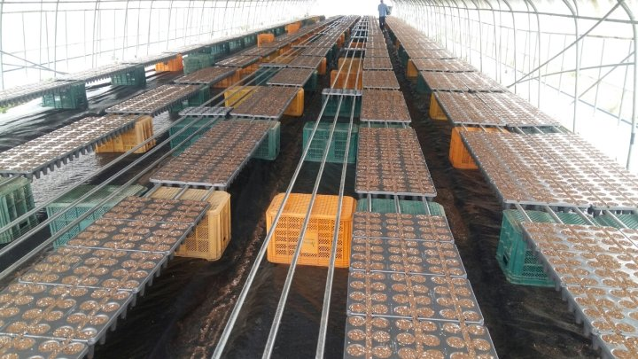
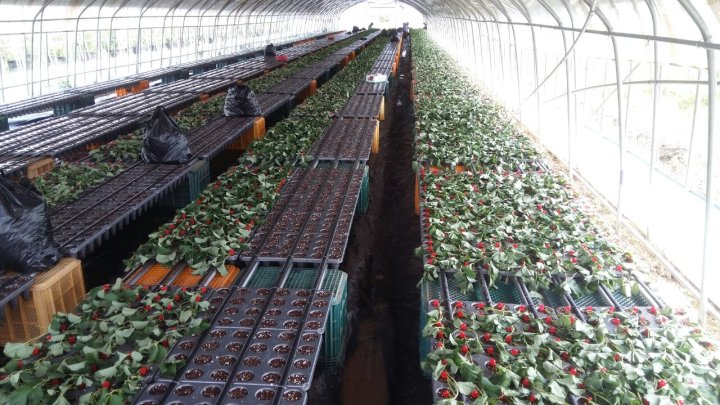
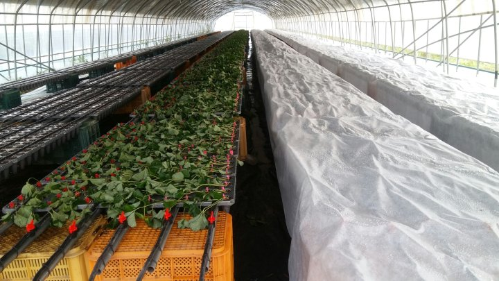
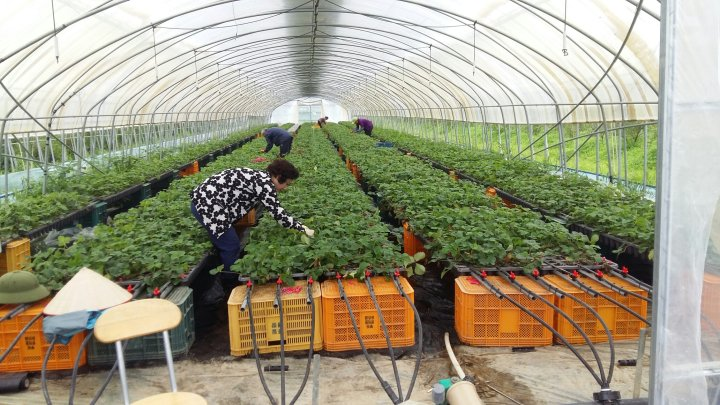
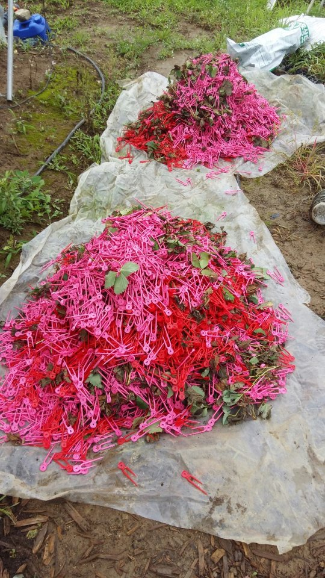
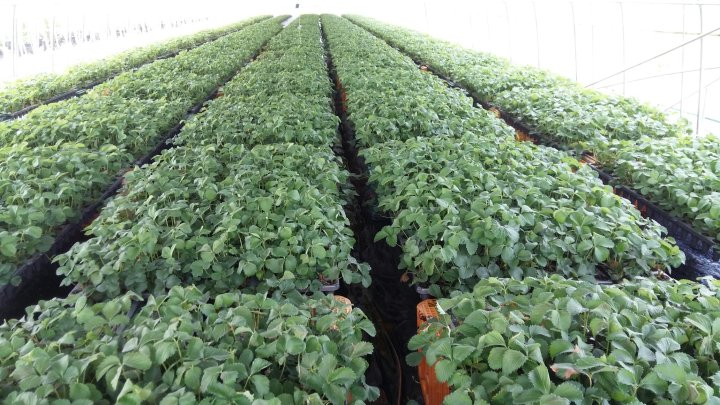
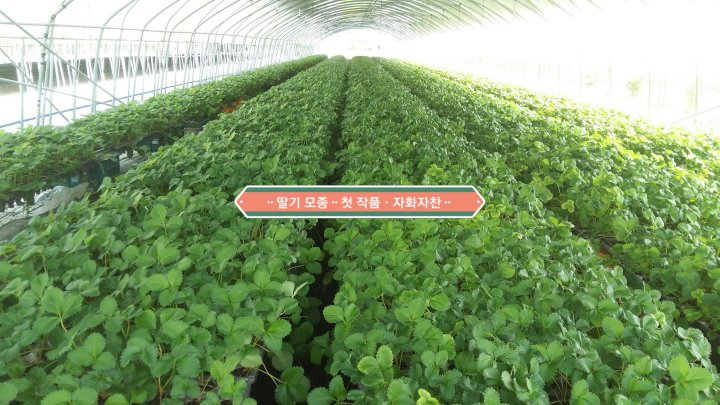
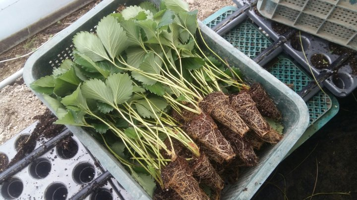
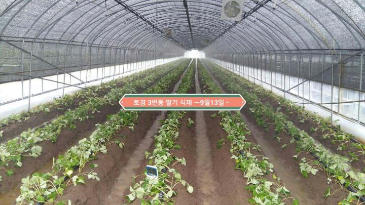

# 2018년 9월 14일 오전 10:26
180912 청화농원 영농일지^^
딸기 농사를 시작한지 벌써 4년째 되어간다
전년도 까지는 모종을 구입해서 농사를 지었는데
올해는 수경재배용 모종은 구입하고 토경 딸기밭에 심을 모종은 자가 육묘를 하였다
혹시 잘 못되면 어쩌나 하는 생각과 늦게 모종 구입 할 수 있을까 아니면 토경 딸기 식재는 포기해야 하나 등등
많은 고민 끝에 행불무득 이라는 글을 가슴에 새기고 언젠가는 가야할 길 이기에 펑소 덮어 두었던 육묘 관련 책을 보고 대구대 황진규 박사님의 지도와 선배님들의 경험을 배워서
육묘를 시작 했는데 걱정은 사라지고 자신감은
생기고ᆢ
올해의 경험을 바탕으로 내년에는 더나은 방법으로 환경 관리를 잘 해서 더욱더 튼튼한 
육묘를 하기위해 오늘도 들판으로 산으로ᆢ
병해충 없이 무탈하게 잘 자라준 식구들이 너무
고마운 마음이다ᆢ

