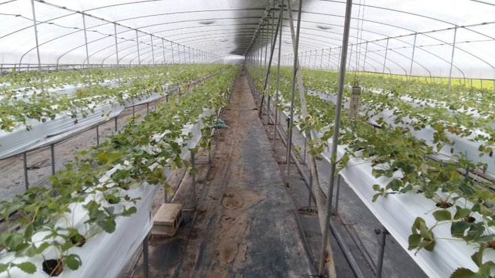
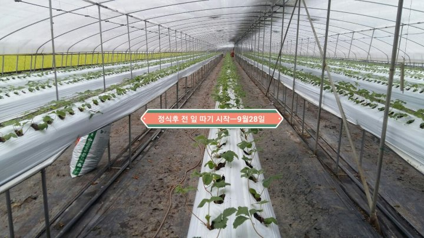

# 2018년 9월 30일 오후 09:10
180928 청화농원 농사일기ᆢ
딸기 수확 마감한 5월ᆢ
5월에 복숭아 적과하고 봉지 쉬우고
무더운 여름과 복숭아랑 놀러 다녔는데 
벌써 딸기 모종을 심고 전 잎을 딴다
언제 무더웠냐고  물어 보는데 생각이 나질 않는다
언제 였던가?
엊그제 같았는데 지나고 보니 
눈 한번 깜박 했는데 시간이 흘렀네
시간이 어디로 갔을까?
오늘도 시간을 묶어두고 내일도 시간을 잡아 둔다
무엇으로 어떻게 붙잡아 둘까ᆢ
지금도 내일도 열심히 일하면서 잠깐 쉴때 생각해 보자ᆢ

